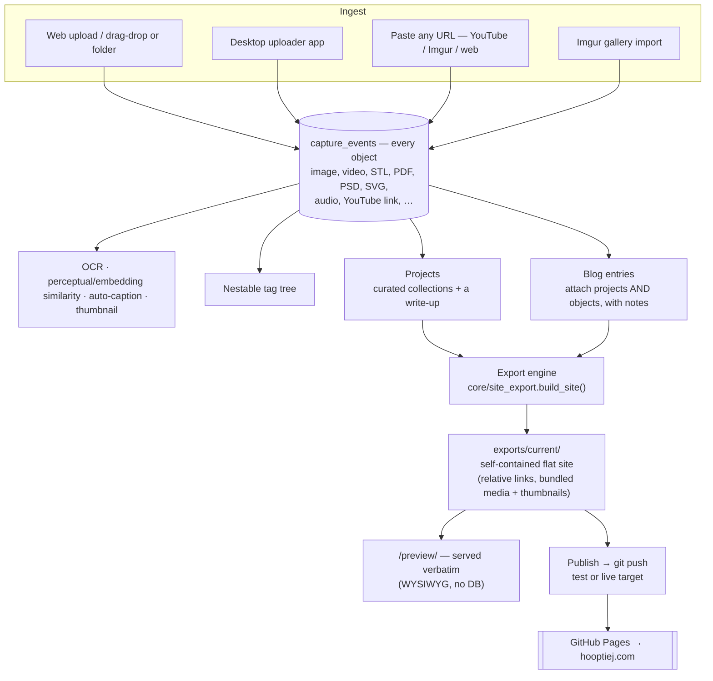
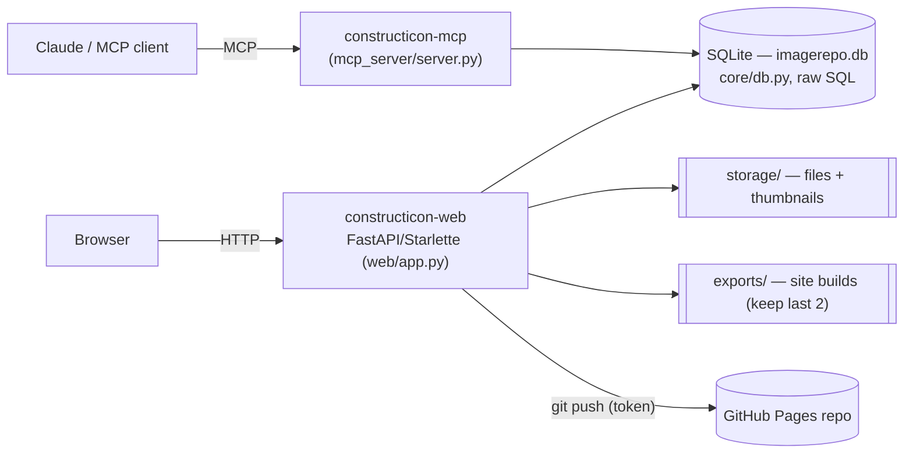
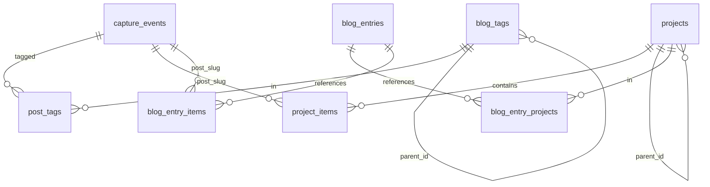

# Constructicon

Named after the Transformers Decepticon that assembles itself out of smaller
robots — because of what this app is *for*: pulling in individual pieces of
content (uploads, posts, links) and assembling them into something bigger — a
**Project**, a **Blog entry**, and ultimately a whole **website**. (It was
forked and repurposed from
[imagerepo](https://github.com/ComputerCats-Jason/imagerepo), but that's
incidental — vestiges of that origin still echo through some field names.)

## What it is

A self-hosted **media gallery + content store** that doubles as the **control
room for a static personal site** ([hooptiej.com](https://hooptiej.com)). You
ingest content, curate it into Projects and Blog entries, then **export a
self-contained static website** and preview it — and, when you're ready,
**publish it to GitHub Pages**.

It runs as a FastAPI/Starlette app (`web/app.py`) backed by SQLite
(`core/db.py`, no ORM) on a LAN-only home server with **no login** — the
network perimeter is the security boundary, not an auth gate. Constructicon
itself always stays private; only the *exported* static site is ever public.

## How it works

The whole pipeline, from a dropped file to a published page:



**The key idea:** `capture_events` holds *every* object. **Projects** and
**Blog entries** are hand-curated ways those objects come together. The
**export engine** flattens whatever you select into a static site whose
`/preview/` is the exact bytes that would ship — so previewing *is* the QA.

## Architecture



- **`web/app.py`** — every HTTP route: page routes (Jinja2 templates in
  `web/templates/`), the `/api/*` JSON+form API the templates' JS calls, the
  public `/f/<slug>` hotlink/thumbnail routes, and the `/preview/` static mount.
- **`core/db.py`** — the schema source of truth and all SQLite access (no ORM).
- **`core/object_types/`** — a registry of per-type specs (thumbnailing, OCR
  eligibility, metadata). Adding a file type is one spec, not edits across the app.
- **`core/site_export.py`** — the export engine (gather → render the Jinja
  templates in `web/export_templates/` → bundle media → build report; plus the
  git publish).
- **`core/ocr.py` / `core/similarity.py` / `core/captions.py`** — text
  extraction, "related items", and local-vision auto-captions.
- **`mcp_server/server.py`** — the live `constructicon-mcp` tool surface for
  driving the app from an agent.

## The content model

| Table | What it is |
|---|---|
| `capture_events` | **Every object** — one row per image/video/STL/PDF/link/etc. `slug` is the unguessable URL id; `media_type` classifies it; files live in `storage/` (or `external_url` for links). |
| `blog_tags` / `post_tags` | A tag tree (nestable to any depth) and its many-to-many join to objects. |
| `projects` / `project_items` | Hand-curated collections of objects with manual ordering, plus an optional `writeup_slug` pointing at a write-up document. |
| `blog_entries` / `blog_entry_projects` / `blog_entry_items` | Dated narratives that attach **both projects and objects**, each with a per-attachment note and sort order. The unit the export turns into blog pages. |
| `app_settings` | Generic key/value store for secrets/config (API keys, the Pages publish token + targets) — surfaced presence-only, never echoed back. |



## Features

- **Ingest** — drag-and-drop upload (a folder drop becomes a Project), a
  separate **desktop uploader app** (`desktop_app/`), pasting any URL
  (YouTube / Imgur / generic web page, classified server-side), and a
  one-click **Imgur gallery import**.
- **OCR & search** — images are OCR'd (`tesseract`), PDFs use their text layer;
  everything is searchable.
- **Related items** — perceptual-hash + sentence-transformer similarity surface
  related objects on a detail page.
- **Auto-captions** — optional local vision model (`moondream` via Ollama) drafts
  caption *suggestions*.
- **Projects & write-ups** — curate objects into a Project, then point Claude at
  its files and it reconstructs a plausible build chronology (from timestamps,
  renders, OCR text, video frames) and drafts a write-up for a quick correction
  pass. Turning a pile of old files into a readable history is the standout
  feature.
- **Blog entries** — dated narratives that pull together one or more projects
  *and* loose objects, each attachment carrying its own note.
- **Export → preview → publish** — build a self-contained static site from any
  selection of projects/blog entries; preview it verbatim at `/preview/`; publish
  it to a **test** or **live** GitHub Pages repo with one click (fine-grained PAT
  in admin settings; CNAME preserved, `.nojekyll` written, builds kept for
  rollback).
- **A live MCP server** — list/search/tag/project/blog tools for driving the app
  from an agent session, plus a per-item `agent_notes` field.
- **Backup** — `POST /api/backup` snapshots the DB + storage to a zip on demand.

## Supported file types

Each type is a self-contained module in `core/object_types/` (thumbnailing,
OCR-eligibility, metadata) registered into a shared dispatch table.

| Type | Extensions |
|---|---|
| Image | `.png` `.jpg` `.jpeg` `.ico` `.bmp` `.tiff` `.tif` `.webp` |
| Animated GIF | `.gif` |
| Video | `.mov` `.mp4` |
| Audio | `.mp3` `.m4a` `.ogg` `.wav` |
| PDF document | `.pdf` |
| 3D printing file | `.stl` |
| Photoshop document | `.psd` |
| Illustrator file | `.ai` |
| Vector graphic | `.svg` `.eps` |
| Font | `.ttf` `.otf` |
| Data file | `.csv` |
| Source code | `.php` `.py` `.js` `.sh` `.json` `.yaml` `.yml` `.html` `.css` `.sql` |
| Archive | `.zip` `.7z` |

Plus non-file content types (a URL, no upload): **YouTube video**, **Imgur
upload**, generic **web page**, **live stream**, and a plain **written post**
(the type project write-up documents use). Unrecognized extensions still store
fine — they just get no thumbnail/OCR until a spec is added.

## Export & publish, in detail

1. **Build** — the export builder (a drawer in the app) lets you pick which
   projects and blog entries to include plus site title/tagline, then
   `build_site()` gathers them, renders the `web/export_templates/` Jinja
   templates to flat HTML with **all-relative links**, and bundles each object's
   original file *and* its rendered thumbnail into `media/`. Output goes to
   `exports/<timestamp>/`, mirrored to `exports/current/`, pruned to the last 2.
2. **Preview** — `/preview/` is a `StaticFiles` mount over `exports/current/`, so
   you're looking at the exact bytes that would ship — no DB, no re-render.
3. **Publish** — pushes `exports/current/` to a configured GitHub Pages repo
   (a **test** target and a **live** target), preserving the target's `CNAME`
   and adding `.nojekyll`. Auth is a fine-grained PAT stored in admin settings;
   it's used only as an ephemeral push credential, never written to `.git/config`
   or logged.

## Deployment

Runs on a shared home server as two plain `docker compose` containers —
`constructicon-web` and `constructicon-mcp` — with `core/`, `web/`, and
`mcp_server/` bind-mounted (a code deploy is a `git pull` + restart; only
`requirements.txt`/Dockerfile changes need `--build`). Isolated
`constructicon-test` / `constructicon-test-mcp` siblings mirror it for testing
changes before production. See [`CLAUDE.md`](CLAUDE.md) for the full deployment
runbook, data-model notes, and gotchas.

## Running locally

```bash
pip install -r requirements.txt
uvicorn web.app:app --host 0.0.0.0 --port 8000 --reload
```

Needs `tesseract-ocr`, `libcairo2`, and `ghostscript` for OCR / SVG / EPS
thumbnailing (missing them degrades those features rather than crashing), and
`git` for the publish step. `imagerepo.db` and `storage/` are created at the repo
root on first run (both gitignored).

## Palette

`web/static/style.css`'s `:root` custom properties are a Transformers-
Constructicons palette (construction-vehicle yellow-green, deep purple accents,
dark chassis, hazard-stripe yellow/black) — swap `--accent` / `--purple*` /
`--hazard-*` to retheme; nothing else should need to change.
